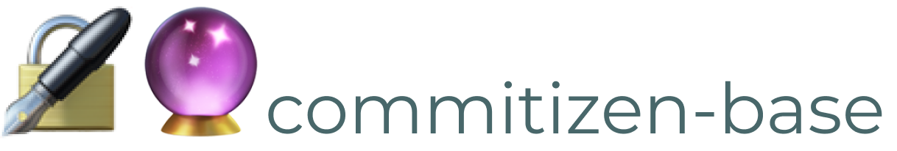

<div align="right">
  <h1>
    
  </h1>

  <!-- prettier-ignore-start -->
  <a href="https://www.npmjs.com/package/@crystal-ball/commitizen-base">
    
  </a>
  <a href="https://www.npmjs.com/package/@crystal-ball/commitizen-base">
    
  </a>
  <a href="https://github.com/crystal-ball/commitizen-base/actions?workflow=CI%2FCD">
    
  </a>
  <a href="https://snyk.io/test/github/crystal-ball/commitizen-base?targetFile=package.json">
    
  </a>
  <a href="https://codeclimate.com/github/crystal-ball/commitizen-base/test_coverage">
    
  </a>
  <a href="https://codeclimate.com/github/crystal-ball/commitizen-base/maintainability">
    
  </a>
  <code>:status&nbsp;&nbsp;&nbsp;&nbsp;&nbsp;&nbsp;</code>

  <br />
  <a href="https://renovatebot.com/">
    
  </a>
  <a href="https://commitizen.github.io/cz-cli/">
    
  </a>
  <a href="https://github.com/crystal-ball/commitizen-base/settings/secrets/new#workspaces/-projects-5b88b5c9af3c0a2186966767/board?repos=213916365">
    
  </a>
  <a href="https://semantic-release.gitbook.io/semantic-release/">
    
  </a>
  <a href="./CODE_OF_CONDUCT.md">
    
  </a>
  <code>:integrations</code>

  <br />
  <a href="https://github.com/crystal-ball">
    
  </a>
  <a href="https://github.com/crystal-ball/crystal-ball.github.io">
    
  </a>
  <code>:flair&nbsp;&nbsp;&nbsp;&nbsp;&nbsp;&nbsp;&nbsp;</code>
  <!-- prettier-ignore-end -->

  <h1></h1>
  <br />
  <p align="center">
    <em>Automated commit message formatting with Commitizen</em>
  </p>
  <br />
</div>

This package contains an adapter for using [Commitizen][] with 🔮 Projects.
Standardized commit messages are constructed using an interactive prompt with
options for long descriptions, emojis, breaking change notes and release notes.

---

## ⚙️ Setup

_1. Install_

```sh
npm i -D @crystal-ball/commitizen-base husky
```

_2. Configure `package.json`_

```json
{
  "config": {
    "commitizen": {
      "path": "@crystal-ball/commitizen-base"
    }
  },
  "husky": {
    "hooks": {
      "prepare-commit-msg": "exec < /dev/tty && git cz --hook"
    }
  }
}
```

<!-- Links -->

[commitizen]: https://commitizen.github.io/cz-cli/
